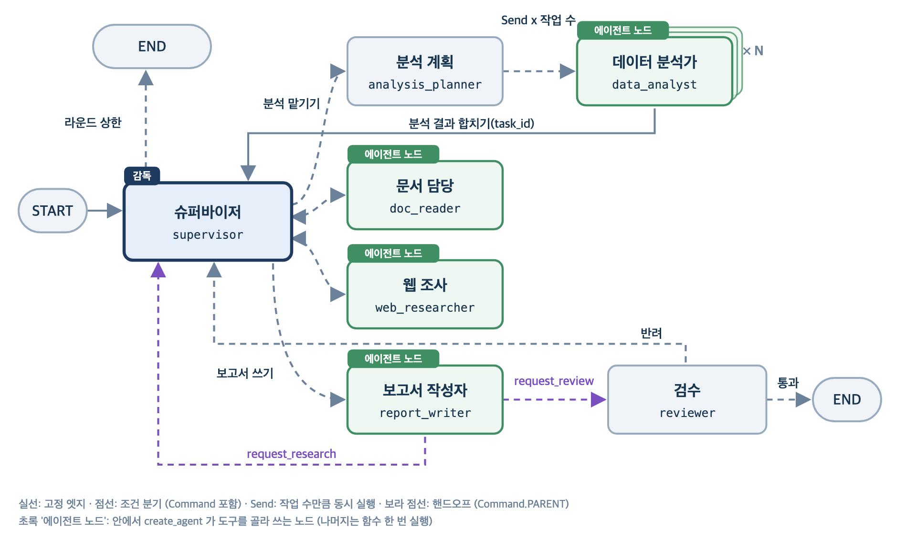
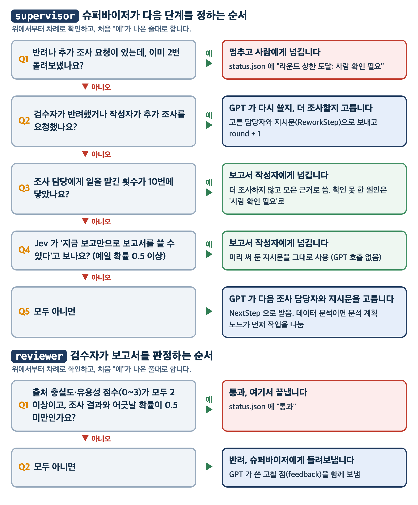

# 종합실습01: 콘텐츠 하락 원인 분석 팀 (슈퍼바이저 · 병렬 분석 · 핸드오프 · 검수)

가상의 IT 미디어 **모아테크**의 9월 콘텐츠 유입이 8월보다 30% 가까이 줄었습니다. 이 팀은 원인을 찾아 대응안 보고서를 씁니다.
교안 01(슈퍼바이저와 워커)과 교안 02(동적 계획, 병렬, 핸드오프)에서 배운 것을 한 프로젝트에 모았습니다.

- **슈퍼바이저:** 지금까지 모인 보고를 읽고 다음 담당자를 고릅니다. 보고서를 쓸 만큼 근거가 모였는지는 Jev 가 확률로 판정하고, 아직이면 GPT 가 다음 담당자와 지시문을 정합니다(구조화 출력). 담당자는 자기에게 허락된 MCP 도구만 씁니다.
- **병렬 분석:** 분석 계획 노드가 채널별(경로별 조회, 검색, 유튜브, 소셜, 뉴스레터) 분석 작업을 나누고, `Send`로 분석가를 작업 수만큼 동시에 띄웁니다. 결과는 task_id를 키로 합칩니다.
- **핸드오프와 검수:** 보고서 작성자가 `request_review`로 검수에, `request_research`로 슈퍼바이저에게 제어권을 넘깁니다. 검수는 Jev 점수로 통과를 정하고, 반려 뒤 다시 하기는 `MAX_ROUNDS`(2번)까지만 합니다. 그 뒤에도 반려되면 `status.json`에 "라운드 상한 도달: 사람 확인 필요"를 남기고 끝냅니다.

**실행 결과물** (`output/<실행 시각>/`)

| 파일 | 내용 |
|---|---|
| `report.md` | 하락 원인과 대응안 보고서 (경로별 증감표, 원인별 근거 수치, 원인이 아닌 것, 대응안) |
| `*.png` | 분석가가 코드 실행 서버로 그린 차트(파일 이름 앞에 분석 작업 번호) |
| `messages.json` | 슈퍼바이저 지시, 조사 워커와 분석가의 대화, 검수 반려 피드백 기록(작성자의 대화는 핸드오프로 중단되어 남지 않습니다) |
| `status.json` | 끝난 상태(통과 또는 라운드 상한 도달)와 그 결정의 검수 판정, 피드백 |

## 팀 구성



| 에이전트(노드) | 하는 일 | 쓰는 도구 (MCP) |
|---|---|---|
| `supervisor` 슈퍼바이저 | 보고와 검수 결과를 읽고 다음 담당자와 지시문을 정한다. Jev 가 근거가 충분하다고 보거나 일을 맡긴 횟수가 상한에 닿으면 보고서 작성자에게 넘기고, 반려가 오면 횟수를 세며 고쳐 쓰기나 추가 조사로 보낸다 | 없음 |
| `analysis_planner` 분석 계획 | 슈퍼바이저 지시를 채널별 분석 작업(최대 4개)으로 나눈다. task_id는 코드가 채널로 만든다 | 없음 |
| `data_analyst` 데이터 분석가 | 분석 작업 하나를 맡아 DB·CSV를 집계하고 차트를 그린다. 작업 수만큼 동시에 돈다 | SQLite 조회, 코드 실행 |
| `doc_reader` 문서 담당 | 회의록·정책 PDF에서 같은 시기의 사내 결정을 찾는다 | markitdown |
| `web_researcher` 웹 조사 | 꺾인 날짜 전후의 외부 사건(검색·플랫폼 변화)을 찾는다 | Tavily 검색 |
| `report_writer` 보고서 작성자 | 팀 기록의 수치와 출처만으로 보고서를 쓰고 `report.md`로 저장한 뒤 검수를 요청한다. 자료가 모자라면 추가 조사를 요청한다 | 파일 쓰기, 핸드오프 도구 2개 |
| `reviewer` 검수 | Jev 점수 두 개(출처 충실도, 유용성)와 보고서가 팀 보고와 어긋날 확률로 통과를 정한다. 반려면 GPT가 고칠 점을 쓴다 | 없음 |

워커끼리는 직접 대화하지 않습니다. 워커 노드가 슈퍼바이저의 지시문과 팀 기록(요청, 분석 결과, 워커 보고를 이은 글)을 함께 에이전트에게 넘깁니다.

## 사용하는 도구

MCP 서버 다섯 개를 `npx`·`uvx` 로 띄워 도구를 받고, 핸드오프 도구 두 개는 직접 만들었습니다. MCP 도구 이름 앞에는 서버 이름(`db_`, `code_`, `docs_`, `web_`, `files_`)이 붙습니다.

| 도구 | 종류 | 하는 일 | 쓰는 담당 |
|---|---|---|---|
| `db_read_query`, `db_list_tables`, `db_describe_table` | MCP `mcp-server-sqlite` | content.db 조회. 쓰기 도구는 주지 않음 | data_analyst |
| `code_run-code` | MCP `mcp-server-code-runner` | CSV 집계와 차트를 그리는 파이썬 코드 실행 | data_analyst |
| `docs_convert_to_markdown` | MCP `markitdown-mcp` | PDF 문서를 마크다운으로 읽기 | doc_reader |
| `web_tavily_search` | MCP `tavily-mcp` | 웹 검색 | web_researcher |
| `files_write_file` | MCP `@modelcontextprotocol/server-filesystem` | 이번 실행 폴더에 report.md 쓰기 | report_writer |
| `request_review`, `request_research` | 직접 만든 `@tool` (`tools/handoff.py`) | `Command.PARENT` 로 검수자나 슈퍼바이저에게 넘기기 | report_writer |

## 준비

1. **Node.js 22 이상**과 **uv**가 필요합니다. MCP 서버를 `npx`와 `uvx`로 띄웁니다. `node -v`, `uvx --version`으로 확인합니다.
   - **macOS:** [공식 설치 파일(.pkg)](https://nodejs.org/ko/download)에서 LTS 버전을 받아 설치하거나, Homebrew 로 `brew install node` 를 실행합니다.
   - **Windows:** [공식 설치 파일(.msi)](https://nodejs.org/ko/download)에서 LTS 버전을 받아 설치하거나, PowerShell 에서 `winget install OpenJS.NodeJS.LTS` 를 실행합니다.
   - 설치 후 터미널을 새로 열고 `node -v` 가 `v22` 이상인지 확인합니다.
2. 저장소 최상위 폴더에서 `uv sync`로 공용 환경을 맞춥니다.
3. 이 프로젝트 폴더(`app/` 폴더가 보이는 곳)에서 `.env.example`을 `.env`로 복사하고 키를 채웁니다. **`.env`가 없으면 import 단계에서 멈춥니다.**
   - **macOS / Linux 터미널:** `cp .env.example .env`
   - **Windows PowerShell:** `Copy-Item .env.example .env`

| 키 | 용도 | 발급 |
|---|---|---|
| `OPENAI_API_KEY` | 슈퍼바이저와 분석 계획(GPT 구조화 출력), 워커 에이전트, 검수 피드백 | [OpenAI 콘솔](https://platform.openai.com/api-keys) |
| `TYPESAFE_API_KEY` | Jev 판정(근거 충분 확률, 보고서 검수 점수) | [TypeSafe 콘솔](https://console.typesafe.ai/keys) |
| `TAVILY_API_KEY` | 웹 검색 MCP (무료 월 1,000 크레딧) | [Tavily](https://app.tavily.com/) |

## 실행

터미널에서 이 프로젝트 폴더(`app/` 폴더가 보이는 곳)로 이동한 뒤 실행합니다. 실행 명령은 macOS 터미널과 Windows PowerShell 에서 똑같습니다.

```bash
uv run -m app.main "9월 콘텐츠 유입이 8월보다 30% 가까이 빠졌어. 원인과 대응안 보고서 써 줘"
```

다른 요청 예시 (데이터는 7~9월 사내 자료라 그 안에서 묻습니다)

```bash
uv run -m app.main "유튜브만 봐 줘. 9월 노출 클릭률 하락이 썸네일 정책 변경 때문인지 확인하고 개선안을 써 줘"
uv run -m app.main "9월 중순 인스타그램 유입이 급증했어. 다음 달 예산을 인스타그램에 더 넣어도 되는지 판단해 줘"
uv run -m app.main "블로그 발행을 주 4편에서 주 2편으로 줄인 영향과 다시 늘리면 회복될지 분석해 줘"
```

**왜 `uv run app/main.py` 가 아니라 `uv run -m app.main` 인가요?**

- `-m` 은 module(모듈)의 약자입니다(`--module` 과 같음). 파일 경로가 아니라 모듈 이름으로 찾아 실행하므로 `/` 대신 `.` 을 쓰고 `.py` 는 뺍니다. 예: `app/graph/builder.py` -> `uv run -m app.graph.builder`
- 이 프로젝트의 코드는 `from app.core.config import ...` 처럼 `app` 이라는 이름으로 서로를 불러옵니다.
- `-m` 으로 실행하면 지금 터미널이 있는 폴더가 import 기준이 됩니다. 그래서 반드시 `app/` 폴더가 바로 보이는 프로젝트 폴더에서 실행합니다. 저장소 맨 위나 `day55_...` 폴더에서 실행하면 그 아래에 `app` 이 없어 실패합니다.
- 파일 경로로 실행하면 그 파일이 있는 `app/` 폴더가 기준이 됩니다. `app/` 안에는 `app` 폴더가 없으므로 `ModuleNotFoundError: No module named 'app'` 이 납니다. 터미널을 `app/` 으로 옮겨 `uv run main.py` 를 실행해도 같은 오류가 납니다.
- `PYTHONPATH` 환경변수로 기준 폴더를 따로 지정하는 방법도 있지만 윈도우와 맥의 쓰는 법이 달라 번거롭습니다. 프로젝트 폴더에서 `uv run -m` 으로 실행하는 것이 운영체제와 상관없이 가장 단순합니다.

한 번에 3~6분 걸립니다(반려 라운드가 있으면 더 걸립니다). `supervisor:`로 시작하는 줄에 몇 번째로 일을 맡기는지, 누구를 골랐는지, Jev 의 근거 충분 확률이, `analysis_planner:`와 `reviewer:` 줄에 분석 작업 목록과 검수 판정이 찍힙니다.
MCP 서버가 뜰 때 서버 프로그램이 직접 찍는 기동 메시지가 섞여 나옵니다. `supervisor:`, `analysis_planner:`, `data_analyst:`, `doc_reader:`, `web_researcher:`, `report_writer:`, `reviewer:`로 시작하는 줄만 보면 흐름을 따라갈 수 있습니다.

## 데이터 (`data/`)

분석가와 문서 담당이 읽는 사내 자료입니다. 일별 지표는 2026년 7월 1일부터 9월 30일까지 석 달치이고, 비교는 8월과 9월로 합니다(콘텐츠 목록의 발행일은 2025년 3월부터 있습니다). 실제 공개 통계(위키백과 조회수, 네이버 데이터랩)의 흐름을 바탕으로 만든 가상 데이터입니다.

| 파일 | 내용 | 읽는 담당 |
|---|---|---|
| `content.db` | `contents`(콘텐츠 139개: 채널, 검색어 유형, 발행일), `daily_traffic`(콘텐츠별·유입 경로별 일별 조회수) | data_analyst (SQLite MCP) |
| `search_console.csv` | 검색어별 일별 노출·클릭·CTR·평균 순위 | data_analyst (코드 실행 MCP) |
| `youtube_studio.csv` | 영상별 일별 노출·노출 클릭률·조회·평균 시청 시간 | data_analyst |
| `social_referrals.csv` | 소셜 플랫폼별 일별 유입 | data_analyst |
| `newsletter.csv` | 뉴스레터 호별 발송·오픈·클릭 | data_analyst |
| `docs/editorial_meeting_2026-08-20.pdf` | 8월 편집 회의록 | doc_reader (markitdown MCP) |
| `docs/content_policy_2026-09.pdf` | 9월 콘텐츠 정책 | doc_reader |

하락에는 원인이 여럿 섞여 있고, 늘어난 지표처럼 원인으로 오해하기 쉬운 함정도 하나 있습니다.

## 폴더 구조와 역할

```
app/
├── core/      모든 층이 함께 쓰는 설정과 판단 기준
│   ├── config.py     파일 경로, 모델 이름, 반복 상한 MAX_TURNS·MAX_ROUNDS
│   ├── prompts.py    슈퍼바이저, 분석 계획, 워커, 검수자의 프롬프트
│   ├── schemas.py    GPT 구조화 출력 모양 NextStep, ReworkStep, AnalysisPlan
│   └── judge.py      Jev 판정: 근거 충분 확률, 보고서 점수
├── tools/     에이전트에게 붙이는 도구
│   ├── mcp_servers.py  MCP 서버 다섯 개 연결과 워커별 허용 도구 ALLOWED_TOOLS
│   └── handoff.py      작성자가 검수자·슈퍼바이저로 넘기는 request_review, request_research
├── agents/    그래프 실행 전에 한 번 만들어 두는 에이전트
│   └── workers.py      허용 도구만 붙인 워커 에이전트 create_workers
├── graph/     LangGraph 워크플로
│   ├── state.py        팀 공유 TeamState 와 분석 결과 리듀서 merge_analyses
│   ├── nodes.py        supervisor, analysis_planner, data_analyst, 워커, report_writer, reviewer 노드
│   ├── edges.py        분석 작업 수만큼 data_analyst 로 보내는 Send 함수 dispatch
│   └── builder.py      노드와 엣지를 연결해 compile 하는 build_graph
└── main.py    요청을 받아 그래프를 실행하고 output/ 에 결과 저장
```

**층 구조(레이어드 아키텍처):** `core -> tools -> agents -> graph -> main` 순서로 쌓습니다. 위 층은 아래 층과 같은 층의 코드를 import 할 수 있지만, 아래 층은 위 층을 import 하지 않습니다.

- 바꿀 곳이 한 층에 모입니다. 설정(모델 이름, 반복 상한, 통과 기준 같은 값)은 `core`, 도구 교체는 `tools`, 흐름 변경은 `graph` 만 고칩니다.
- 아래 층은 위 층 없이 불러올 수 있어서 모듈마다 따로 실행하고 테스트할 수 있습니다.

## 슈퍼바이저와 검수가 다음 단계를 정하는 규칙



- **턴(`turn`):** 슈퍼바이저가 담당자에게 일을 맡긴 횟수. 상한은 `MAX_TURNS`(10)
- **라운드(`round`):** 반려(검수 반려, 작성자의 추가 조사 요청)를 처리한 횟수. 상한은 `MAX_ROUNDS`(2)
- **근거 충분 확률:** 지금 모인 보고만으로 하락 원인 보고서를 쓸 수 있다고 Jev 가 보는 확률. 조건 네 가지는 `core/judge.py`의 `ENOUGH_QUESTION`

## TODO 정리

의존성이 적은 것부터(도구 -> 에이전트 -> 라우팅 함수 -> 노드 -> 그래프 조립) 파일별로 채웁니다. 코드의 `# TODO:` 아래 단계 주석을 따라 작성합니다. 중간에 실행하면 아직 비어 있는 TODO 에서 `NotImplementedError` 로 멈추므로, 멈춘 위치로 남은 일을 확인할 수 있습니다.

- [ ] 실행 준비 : Node.js 22 이상, `uv sync`, `.env` 키 채우기
- [ ] tools/handoff.py 구현 : 작성자의 핸드오프 도구
    - [ ] request_research : Command.PARENT 로 supervisor 에 빠진 자료를 실어 넘기기 (request_review 는 제공) `[교안 02 6-1 핸드오프와 Command.PARENT, 6-2 핸드오프 도구]`
- [ ] agents/workers.py 구현 : 워커와 도구 권한
    - [ ] create_workers : 워커마다 ALLOWED_TOOLS 의 MCP 도구만 골라 create_agent 로 만들기 (작성자는 핸드오프 도구와 writer_llm) `[교안 01 5-1 담당별 도구, 5-2 워커 에이전트 / 교안 02 6-2 parallel_tool_calls]`
- [ ] graph/edges.py 구현 : 병렬 분석 분배
    - [ ] dispatch : 분석 작업마다 data_analyst 로 가는 Send 목록 (계획이 비면 supervisor) `[교안 02 3-1 Send의 모양]`
- [ ] graph/nodes.py 구현 : 판단과 실행 노드
    - [ ] supervisor (1) 반려 처리 : round 가 MAX_ROUNDS 에 닿았으면 status.json 을 남기고 END, 아니면 ReworkStep 으로 다음 담당과 지시문을 받고 round + 1 `[교안 02 6-4 검수 결과에 따라 다시 돌기, 6-5 supervisor]`
    - [ ] supervisor (2) 보고서로 넘길지 : turn 이 MAX_TURNS 에 닿았으면 WRITE_REPORT_AT_CAP, 근거 충분 확률이 0.5 이상이면 WRITE_REPORT_INSTRUCTION 지시문으로 report_writer 에게 `[교안 01 5-7 처리 상한과 상담원 연결]`
    - [ ] supervisor (3) 다음 담당 : NextStep 으로 담당자와 지시문을 받아 Command(goto, update) `[교안 01 4-2 Command, 5-4 슈퍼바이저 노드]`
    - [ ] worker : 에이전트를 실행해 새 보고 하나를 findings 에 담고 supervisor 로 돌아가기 `[교안 01 5-5 워커 노드 / 교안 02 4-1 operator.add]`
    - [ ] reviewer : Jev 판정으로 통과면 상태를 남기고 END, 반려면 피드백을 붙여 supervisor 로 `[교안 02 6-3 검수 노드]`
- [ ] graph/builder.py 구현 : 그래프 조립
    - [ ] build_graph : 노드를 destinations 와 함께 등록하고 START, Send 분배, 분석가 복귀 엣지를 이어 컴파일 `[교안 01 5-6 그래프 조립 / 교안 02 3-5 Send 연결, 6-7 팀 그래프 연결]`
- [ ] 실행 확인 : `uv run -m app.main "요청"` 으로 report.md 와 status.json 이 생기는지 확인

**미리 제공된 것** (읽기만 하면 됩니다): `core/` 전체(설정, 프롬프트, 구조화 출력 스키마, Jev 판정), `tools/mcp_servers.py`, `request_review`, `graph/state.py`(State, `merge_analyses` 리듀서), `graph/nodes.py`의 분석 계획·분석가·보고서 작성 노드와 보조 함수, `main.py`
