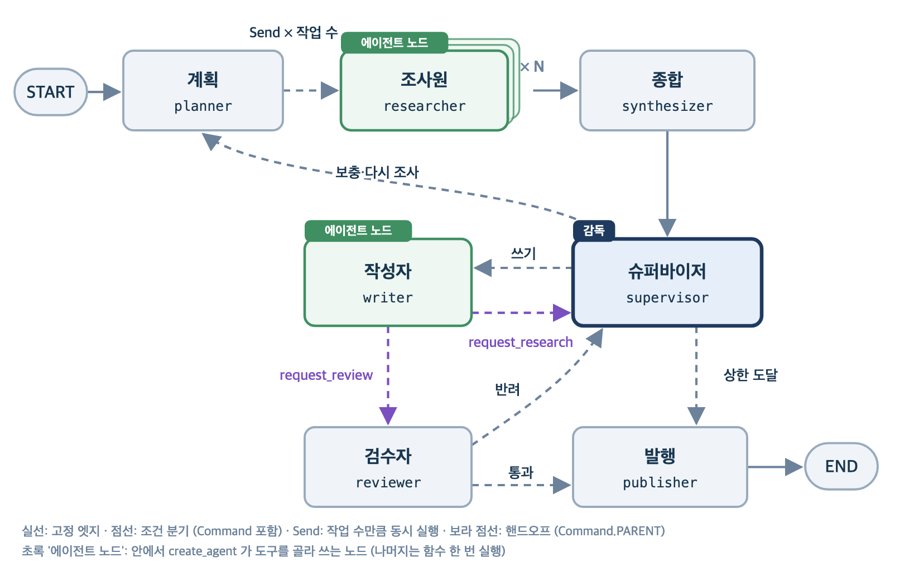
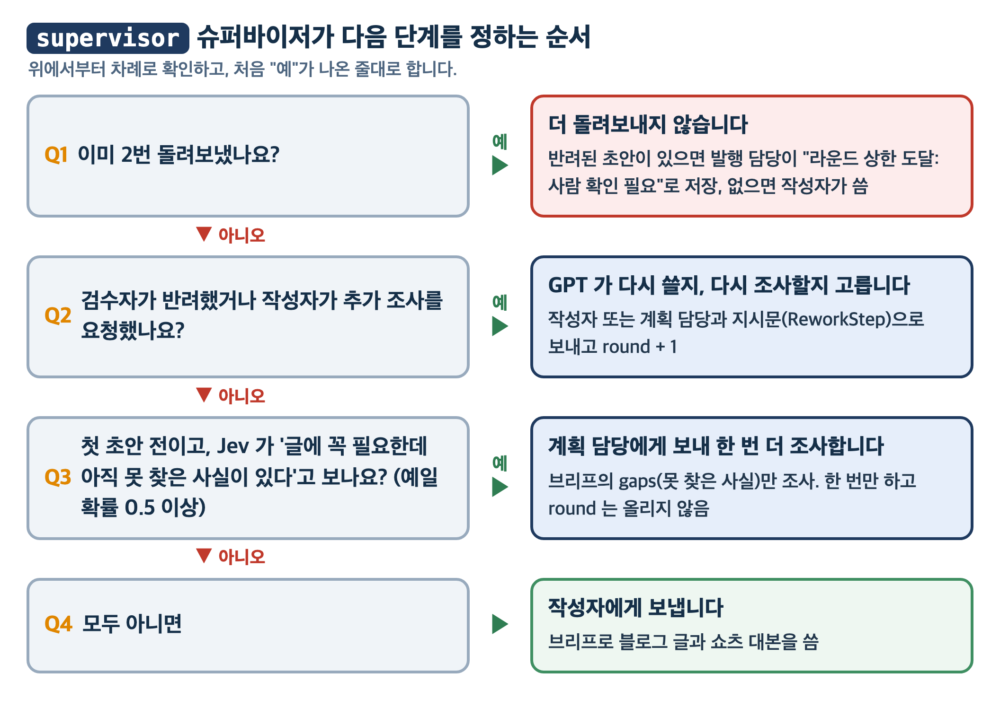

# 종합실습02: 콘텐츠 생성 팀 (동적 계획 · 병렬 조사 · 핸드오프)

종합실습01 분석 팀이 쓴 보고서(`data/analysis_report.md`)를 받아, 다음 달 **블로그 글 1편과 쇼츠 대본 1편**을 만드는 팀입니다.
계획 담당이 조사 작업을 몇 개로 나눌지 정하고, 작업마다 조사원(subagent)을 띄워 동시에 조사한 뒤 종합합니다.
작성자가 초안을 다 쓰면 스스로 검수자에게 넘기고(핸드오프), 검수자가 반려하면 다시 씁니다.

**실행 결과물** (`output/<실행 시각>/`)

| 파일 | 내용 |
|---|---|
| `blog.md` | 출처 링크가 달린 블로그 글 |
| `shorts_script.md` | 50초 안팎 쇼츠 대본 |
| `cover.png` | 커버 이미지 (gpt-image-2.5-flare). 검수를 통과했을 때만 생긴다 |
| `sources.json` | 발행 상태(`status`), 검수 판정(`review`), 마지막 피드백(`feedback`), 돌려보낸 횟수(`round`), 출처 목록(`sources`) |

## 팀 구성



| 에이전트 | 하는 일 | 쓰는 도구 |
|---|---|---|
| `planner` 계획 | 보고서와 요청을 읽고 조사 작업을 나눈다(작업마다 자료원과 검색어, 최대 6개). 작업 수는 요청에 따라 그때그때 달라진다 | 없음 (GPT 구조화 출력) |
| `researcher` 조사원 × N | 작업 하나를 맡아 그 자료원 도구로 조사하고, 사실마다 출처 URL 을 단다. 작업마다 새로 만드는 subagent | 자료원별 허용 도구(`ALLOWED_TOOLS`)만: 네이버(블로그·뉴스·데이터랩), 유튜브(검색·상세·자막), Tavily. 다른 자료원 도구는 모른다 |
| `synthesizer` 종합 | 조사 결과를 작성용 요약(브리프)으로 정리한다. 경쟁 콘텐츠의 공통 흐름, 경쟁 콘텐츠가 다루지 않은 내용, 추천 각도, 핵심 주장에 필요한데 조사에서 못 찾은 사실(`gaps`)을 담는다 | 없음 |
| `supervisor` 슈퍼바이저 | 반려되면 다시 쓰기·다시 조사 중 하나를 골라 지시문과 함께 보낸다(GPT 구조화 출력 `ReworkStep`). 첫 초안 전에는 `gaps` 를 꼭 더 조사해야 하는지 Jev 확률로 보고 한 번만 계획으로 돌려보낸다. 돌려보낸 횟수가 상한(`MAX_ROUNDS`)에 닿으면 사람 확인으로 마무리한다 | 없음 |
| `writer` 작성자 | 브리프로 블로그 글과 쇼츠 대본을 쓴다. 다 쓰면 검수 요청 도구를, 사실이 모자라면 추가 조사 요청 도구를 불러 다음 담당을 스스로 정한다(핸드오프) | 파일 쓰기 MCP, `request_review`, `request_research` |
| `reviewer` 검수자 | 초안을 조사 결과와 대조해 Jev 점수로 통과·반려를 정하고, 반려면 고칠 점을 적는다 | 없음 |
| `publisher` 발행 | 통과면 커버 이미지를 만들고 출처 목록을 저장한다. 상한에 닿아 넘어온 미통과 초안은 발행하지 않고 상태를 "라운드 상한 도달: 사람 확인 필요"로 저장한다 | 없음 (이미지 API 를 직접 호출) |

## 사용하는 도구

MCP 서버 다섯 개를 `npx` 로 띄워 도구를 받고, 핸드오프 도구 두 개와 커버 이미지 함수는 직접 만들었습니다. MCP 도구 이름 앞에는 서버 이름(`naver_`, `youtube_`, `transcript_`, `web_`, `files_`)이 붙습니다.

| 도구 | 종류 | 하는 일 | 쓰는 담당 |
|---|---|---|---|
| `naver_search_blog`, `naver_search_news`, `naver_datalab_search` | MCP `@isnow890/naver-search-mcp` | 네이버 블로그·뉴스 검색, 검색어 트렌드 | researcher 의 naver 작업 |
| `youtube_searchVideos`, `youtube_getVideoDetails` | MCP `youtube-data-mcp-server` | 유튜브 영상 검색과 상세 정보 | researcher 의 youtube 작업 |
| `transcript_get_transcript` | MCP `@sinco-lab/mcp-youtube-transcript` | 유튜브 영상 자막 | researcher 의 youtube 작업 |
| `web_tavily_search` | MCP `tavily-mcp` | 웹 검색 | researcher 의 web 작업 |
| `files_write_file` | MCP `@modelcontextprotocol/server-filesystem` | 이번 실행 폴더에 blog.md, shorts_script.md 쓰기 | writer |
| `request_review`, `request_research` | 직접 만든 `@tool` (`tools/handoff.py`) | `Command.PARENT` 로 검수자나 슈퍼바이저에게 넘기기 | writer |
| `generate_cover_image` | 직접 만든 함수 (`tools/cover_image.py`) | 이미지 생성 API 로 커버 이미지 만들기. 에이전트 도구가 아니라 노드가 직접 호출 | publisher |

## 준비

1. **Node.js 22 이상**과 **uv**가 필요합니다. MCP 서버를 `npx`로 띄웁니다. `node -v`, `npx -v`로 확인합니다.
   - **macOS:** [공식 설치 파일(.pkg)](https://nodejs.org/ko/download)에서 LTS 버전을 받아 설치하거나, Homebrew 로 `brew install node` 를 실행합니다.
   - **Windows:** [공식 설치 파일(.msi)](https://nodejs.org/ko/download)에서 LTS 버전을 받아 설치하거나, PowerShell 에서 `winget install OpenJS.NodeJS.LTS` 를 실행합니다.
   - 설치 후 터미널을 새로 열고 `node -v` 가 `v22` 이상인지 확인합니다.
2. 저장소 최상위 폴더에서 `uv sync`로 공용 환경을 맞춥니다.
3. `.env.example`을 `.env`로 복사하고 키를 채웁니다. **`.env`가 없으면 import 단계에서 멈춥니다.**

| 키 | 용도 | 발급 |
|---|---|---|
| `OPENAI_API_KEY` | 계획·종합·작성, 반려 뒤 다음 담당과 지시문(GPT), 커버 이미지 | [OpenAI 콘솔](https://platform.openai.com/api-keys) |
| `TYPESAFE_API_KEY` | Jev 판정(보충 조사 필요 확률, 초안 품질 점수) | [TypeSafe 콘솔](https://console.typesafe.ai/keys) |
| `TAVILY_API_KEY` | 웹 검색 MCP (무료 월 1,000 크레딧) | [Tavily](https://app.tavily.com/) |
| `NAVER_CLIENT_ID`, `NAVER_CLIENT_SECRET` | 네이버 블로그·뉴스·데이터랩 MCP (무료 하루 25,000회) | [네이버 개발자센터](https://developers.naver.com/apps/) |
| `YOUTUBE_API_KEY` | 유튜브 검색 MCP (무료 하루 10,000 유닛, 검색 1회 100 유닛) | [Google Cloud 콘솔](https://console.cloud.google.com/apis/library/youtube.googleapis.com) |

## 실행

```bash
cd day55_멀티에이전트_협업/종합실습02/starter
uv run python -m app.main "보고서 기준으로 다음 달 블로그 글 1편과 쇼츠 대본 1편 만들어 줘"
```

다른 요청 예시 (요청에 적은 주제로 조사하고 씁니다)

```bash
uv run python -m app.main "무선 이어폰 고르는 법을 비교표와 실패 사례 중심으로 블로그 글과 쇼츠 대본으로 만들어 줘"
uv run python -m app.main "직장인이 AI 코딩 도구를 고르는 기준으로 블로그 글과 쇼츠 대본 만들어 줘"
uv run python -m app.main "K-POP 팬 앱(위버스, 버블) 고르는 기준으로 블로그 글과 쇼츠 대본 만들어 줘"
```

한 번 실행에 3~5분이 걸립니다. 화면에 계획한 조사 작업, supervisor 가 고른 다음 담당, 검수 판정이 차례로 찍힙니다.
MCP 서버는 도구를 부를 때마다 새로 뜨고, 뜰 때마다 기동 메시지(`Tavily MCP server running on stdio` 등)를 화면에 섞어 냅니다. 서버 프로그램이 직접 찍는 메시지라 파이썬 쪽에서 끄지 못합니다. `planner:`, `researcher:`, `supervisor:`, `writer:`, `reviewer:`, `publisher:` 로 시작하는 줄만 보면 흐름을 따라갈 수 있습니다.

## 폴더 구조와 역할

```
app/
├── core/      공통 설정과 기준
│   ├── config.py     경로, 모델, 상한 값
│   ├── prompts.py    역할별 프롬프트
│   ├── judge.py      Jev 판정
│   └── schemas.py    GPT 구조화 출력 형식
├── tools/     에이전트가 쓰는 도구
│   ├── mcp_servers.py  MCP 서버 연결과 자료원별 허용 도구
│   ├── handoff.py      작성자의 핸드오프 도구
│   └── cover_image.py  커버 이미지 생성
├── agents/    미리 만들어 두는 에이전트
│   └── workers.py      작성자 에이전트 생성
├── graph/     LangGraph 워크플로
│   ├── state.py        공유 State 와 리듀서
│   ├── nodes.py        노드 함수
│   ├── edges.py        Send 분배 함수
│   └── builder.py      그래프 조립
└── main.py    실행 진입점
```

## 슈퍼바이저가 다음 단계를 정하는 규칙



## TODO 정리

의존성이 적은 것부터(도구 -> 에이전트 -> 라우팅 함수 -> 노드 -> 그래프 조립) 파일별로 채웁니다. 코드의 `# TODO:` 아래 단계 주석을 따라 작성합니다. 중간에 실행하면 아직 비어 있는 TODO 에서 `NotImplementedError` 로 멈추므로, 멈춘 위치로 남은 일을 확인할 수 있습니다.

- [ ] 실행 준비 : Node.js 22 이상, `uv sync`, `.env` 키 채우기
- [ ] graph/state.py 구현 : 병렬 조사 결과 합치기
    - [ ] merge_findings : 조사 결과를 task_id 기준으로 합치는 리듀서 `[교안 02 4-2 dict 병합 리듀서]`
- [ ] tools/handoff.py 구현 : 작성자의 핸드오프 도구
    - [ ] request_review : Command.PARENT 로 바깥 그래프의 reviewer 에게 넘기기 (request_research 는 제공) `[교안 02 6-1 핸드오프와 Command.PARENT, 6-2 핸드오프 도구]`
- [ ] agents/workers.py 구현 : 작성자 에이전트
    - [ ] create_writer : 파일 쓰기 도구와 핸드오프 도구 두 개만 가진 작성자 에이전트 `[교안 01 5-2 워커 에이전트 / 교안 02 6-2 parallel_tool_calls]`
- [ ] graph/edges.py 구현 : 병렬 조사 분배
    - [ ] dispatch : 계획의 작업 수만큼 researcher 로 가는 Send 목록 `[교안 02 3-1 Send의 모양]`
- [ ] graph/nodes.py 구현 : 조사와 판단 노드
    - [ ] researcher : 그 작업의 자료원 도구만 붙인 subagent 를 만들어 실행 `[교안 02 5-4 조사 노드 / 교안 01 5-1 담당별 도구]`
    - [ ] supervisor (1) 횟수 상한과 반려 : 돌려보낸 횟수(round) 상한 확인, 반려면 ReworkStep 으로 다음 담당과 지시문 `[교안 02 6-4 검수 결과에 따라 다시 돌기, 6-5 supervisor / 교안 01 5-7 처리 상한]`
    - [ ] supervisor (2) 보충 조사 판단 : 반려가 없으면 브리프의 gaps 를 더 조사해야 할 Jev 확률로 planner(한 번만) 또는 writer `[교안 02 6-5 supervisor]`
    - [ ] reviewer : Jev 점수로 통과·반려를 정해 Command(goto) 로 보내기 `[교안 02 6-3 검수 노드]`
- [ ] graph/builder.py 구현 : 그래프 조립
    - [ ] build_graph : 노드 등록, 고정 엣지와 Send 분배 엣지 연결, compile `[교안 02 3-5 Send 연결, 6-7 팀 그래프 연결]`
- [ ] 실행 확인 : `uv run python -m app.main "요청"` 으로 blog.md, shorts_script.md, sources.json 이 생기는지 확인

**미리 제공된 것** (읽기만 하면 됩니다): `core/` 전체(설정, 프롬프트, Jev 판정, 출력 형식), `tools/mcp_servers.py`, `tools/cover_image.py`, `tools/handoff.py`의 request_research, `graph/nodes.py`의 planner·synthesizer·writer·publisher, `main.py`
